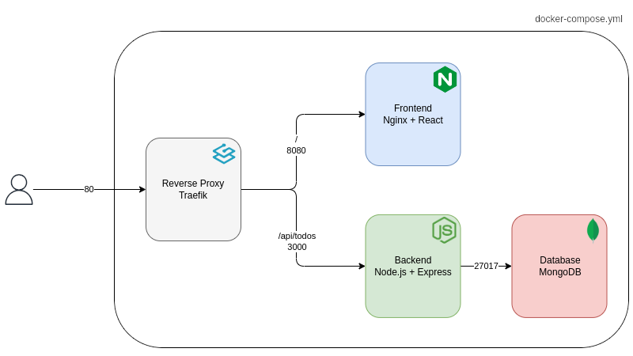
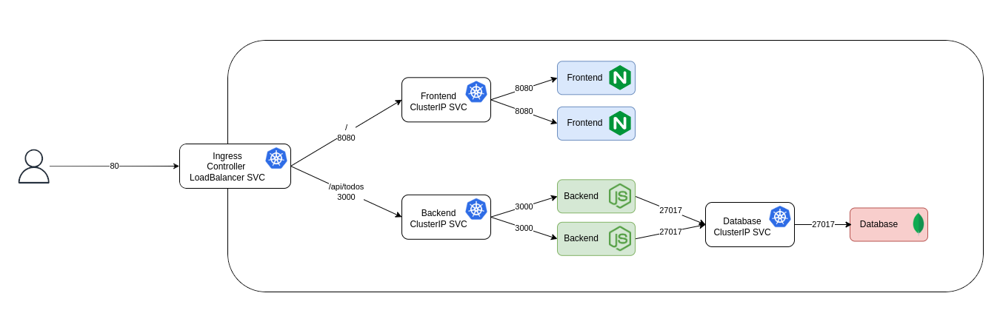

# README

This mono-repo contains a simple todo application composed by

- a frontend developed with React
- a backend developed with Express

and that use MongoDB as database

## Objective

### Phase 1

Analyze the applications codebase and create a docker-compose.yaml stack that build and spin-up an environment matching the one described in the following architecture

### Phase 2

Using the same applications try to replicate the following architecture in a local K8s cluster like Minikube

### Phase 3

Deploy the same infrastructure in AWS using native Services (no EKS), the acrchitecture must be in HA, deploy it using an IaC Framework and the applications must have its CICD pipelines

## Useful resources

- https://docs.docker.com/build/building/multi-stage/
- https://doc.traefik.io/traefik/getting-started/quick-start/
- https://doc.traefik.io/traefik/routing/routers/#rule
- https://hub.docker.com/r/nginxinc/nginx-unprivileged/
- https://ttl.sh/
- https://minikube.sigs.k8s.io/docs/start/
- https://kubernetes.io/docs/tasks/access-application-cluster/ingress-minikube/#enable-the-ingress-controller
